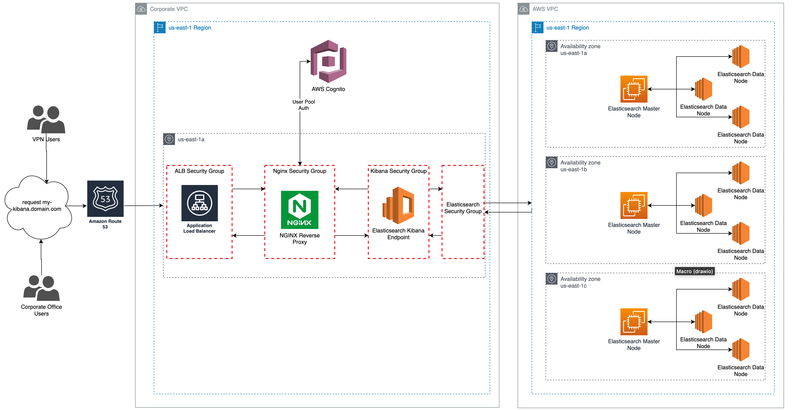

[](https://opensource.org/licenses/MIT)


# Nested stack for Elasticsearch, Cognito, and Nginx. All information regarding these stacks will live here.

## Architecture


## Resource - Elasticsearch
## What this stack does

* Creates an (VPC Only) Elasticsearch Domain which includes a VPC endpoint to which you can interact with Kibana. (Note: The domain can run "headless" or sans VPC endpoint if desired.)

* Creates a security group for the Elasticsearch VPC endpoint.

* Uses existing subnets and VPC.

## Resource - Nginx Proxy

## What this stack does

* Creates an EC2 instance with Nginx installed and configured to redirect requests to Cognito for authentication and then to the Elasticsearch Kibana endpoint.

* Creates CodeDeploy application/deployment group/configuration group so that we can copy some scripts to read our parameterized Nginx configuration file and update it with usable values which ultimately gets copied to its working directory on the EC2.

* Creates a load balancer, HTTP/HTTPS listeners, attaches a pre-existing ACM certificate to the HTTPS listener, Route53 alias, target group, and security groups.

## Resource - Cognito

## What this stack does

* Creates a Cognito User Pool of employees who are permitted to access Kibana dashboard.

* Creates auth and unauth IAM roles and attaches them to the Cognito Identity Pool.

* Creates a Cognito User Pool/Group to control access to the Kibana Endpoint. (Note: Will later support Okta ideally or SAML at minimum). For now, users are manually managed in CloudFormation.

## Resource - Post Deploy

## What this stack does

* Provides lambdas that will complete the deployment due to Cloudformation Template limitations

* Sets the Cognito User Pool Domain URL, Attaches the Cognito Identity Pool IAM Roles, enables Cognito authentication in the Elasticsearch domain and hooks up the Elasticsearch domain to the Cognito User Pool and Cognito Identity Pool.

* Sets the ingress rule for the ElasticSearch security group.

* The post deploy scripts test input is irrelevant. Just make sure you are running it for the environment you would like to affect.

## How to deploy the entire stack set

* You'll need to install pipenv, python, and pip to run the deploy.sh script. Otherwise, you can run just the CloudFormation stacks by themselves (no post-deploy lambdas) using the standard deploy command.
* Get a SAML token for the environment you wish to deploy to or make sure you have an .aws credentials file.

* For DEV, from the root level, run: 
```bash
sh ./elasticsearch/scripts/deploy.sh -e dev
```
###### * After the stack deploys run the two lambdas in the post deploy stack to finish the install. There is no input schema for the Lambda, it is ignored. 

* For PROD, from the root level, run:
 ```bash
sh ./elasticsearch/scripts/deploy.sh -e prod
```

###### * After the stack deploys run the two lambdas in the post deploy stack to finish the install. There is no input schema for the Lambda, it is ignored. If you don't run the lambdas, you will have to make the changes listed in the "fixed by post-deploy script" section by hand.

## Testing stack outputs locally

* The read_replace.py script is dependent on three files.
    1) tokenized_default.conf located in ./config/... which is read by ./scripts/read_replace.py,
    2) es-stack-output.json file which is an output of get_stack_output.sh which performs a query of the outputs of the CloudFormation stack to get actual values for the Domain ARN, Kibana ARN, etc.. that are needed to replace variables in the /config/tokenized_default.conf file.
    3) local_default.conf file which is created as a result of ./config/tokenized_default.conf being read and those variables being replaced with the values from the /config/es_stack_output.json file.

* You can modify the read_replace.py in the /scripts directory and execute it locally by running `export RUN_LOCAL=true` in your shell followed by `python /scripts/read_replace.py`. This will result in the /config/tokenized_default.conf file to be read and the output of .local_default.conf will be created.

* If you are satisfied with the output of local_default.conf, you may execute the `export RUN_LOCAL=false` command in shell and test your new configuration with CodeDeploy.

## Testing CodeDeploy manually

* CODEDEPLOY IS REQUIRED TO INSTALL AND CONFIGURE NGINX ON YOUR EC2. If local stack output testing has been satisfied, you may wish to deploy the package to CodeDeploy manually before running your code through the pipeline. To do this, you will need to push your new package to S3 and then deploy your new package as a new deployment.
    * Run  
    ```bash
    aws deploy push --application-name ${Environment}-${Brand}-kibana --description "testing" --ignore-hidden-files --s3-location s3://dev-#TODO#/kibana/kibanadeploy.zip --source ./elasticsearch --profile ##TODO##
    ```
    * Copy the resulting eTag from the output of the above command and replace the eTag in the deploy command. (below)
    * Run 
    ```bash
    aws deploy create-deployment --application-name ${Environment}-${Brand}-kibana --s3-location bucket=dev-#TODO#-elasticsearch-configs,key=kibana/kibanadeploy.zip,bundleType=zip,eTag=541be9834bfef6b627743d3d5de370de --deployment-group-name dev --deployment-config-name dev-#TODO#-kibana --profile ##TODO##
    ```
    * Check the CodeDeploy console to see your new deployment runs successfully.

## Gotchas

* Do not change outputs from the stack as other services use the stack outputs based on the names. If you change it in one place, change it in CodeDeploy or the Post Deploy Lambdas.

* Currently the Nginx stack doesn't create a certificate. We are using a pre-made certificate in ACM and attaching it in CloudFormation.

* AWS_Cognito_##TODO##_UnAuth and Auth roles need their trust relationships updated in some cases where the Cognito identity pool is destroyed and recreated. 'Condition string equals cognito-identity.amazonaws.com:aud needs to have the value of the current Cognito identity pool.

* Background image needs to be loaded after the user pool is created. Not supported in CloudFormation

* CodeDeploy agent sometimes is not getting installed from user-data script on the EC2.


#
## Fixed With Post-Deploy Script
* CloudFormation does not allow adding the Cognito domain to the CognitoPool. (note)This has to be done before you configure Elasticsearch to use Cognito for authentication.

* CloudFormation does not allow you to attach the Cognito Auth and Unauth roles to the Cognito Identity Pool. 

* CloudFormation does not allow you to hook up the Cognito user pool and identity pool to the ElasticSearch domain. This needs to happen before CodeDeploy runs the nginx.sh script. 

* To avoid a circular dependency, the ingress rule for the Elasticsearch domain needs to be added post-deploy since the security group for the Kibana EC2 (which will be added to the ElasticSearch SG) does not yet exist as the stack is getting built.

## Troubleshooting/Checklist
### 504 Gateway Timeout.
* Once you have deployed, and you are perplexed about why you are getting a gateway timeout, run the deploy script again.
The templates will have no updates, but the enable cognito and code deploy scripts will run. Sometimes this will resolve the issue.
* Ensure the elasticsearch security group includes an inbound 443 rule from the Kibana internal security group.
* SSH into the Nginx EC2 and see if the service is running using `sudo service nginx status`. If it is, restart the service using `sudo service nginx restart`.
    * This is caused by ipv6 being enabled. Check to see if ipv6 is disabled on the EC2 by using `cat /proc/sys/net/ipv6/conf/all/disable_ipv6` and you should see a response of "1". If you see a response of "0", run `sudo vim /etc/sysctl.conf` and ensure the following are added to the end of the file: 
        * net.ipv6.conf.all.disable_ipv6 = 1
        * net.ipv6.conf.default.disable_ipv6 = 1
        * net.ipv6.conf.lo.disable_ipv6 = 1
    * Then run `cat /proc/sys/net/ipv6/conf/all/disable_ipv6` to see if it returns "1". If returns "0", then run 'sudo sysctl -p' and check again. It should now return "1".

### 502 Bad Gateway
* Ensure the security group for the elasticsearch domain includes an HTTPS ingress rule for the security group of the Nginx proxy.

### Cognito auth fails to send you to the Kibana dashboard upon changing your password for the first time.
* Cognito is flaky and you may need to flush cookies or reload the login page in incognito mode to bypass this one-time bug.

### You are not redirected to Cognito upon requesting https://pac-kibana.svc.dhigroupinc.com/
* Check that a domain has been created for the Cognito User Pool.
* Check that "Use Cognito for Authentication" is enabled on the Elasticsearch domain and that the Cognito User Pool and Idendity Pool are selected.

### You authenticate via Cognito and receive a Cognito error that you need an error like `not authorized to perform: es:ESHttpGet`
* Check that the resource policy on the Elasticsearch domain allows `Action - es:*` for the Cognito User Pool.
* Check that the trust relationship for both Cognito Auth and Unauth roles match the arn of the current identity pool. (unusual)

### Helpful References
* https://docs.aws.amazon.com/elasticsearch-service/latest/developerguide/es-cognito-auth.html
